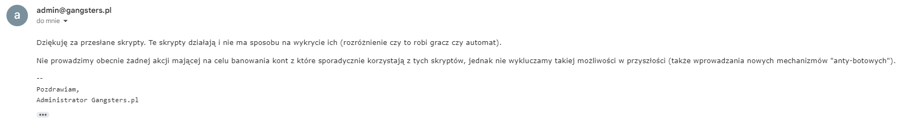
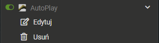

<div align="center">
  <p>
    <h1>g2.gangsters.pl bot</h1>
    <h3>Aktualny na 07.01.2024 (chrome/firefox)</h3>
  </p>
<h1>W ramach sprzeciwu wobec wybiorczego postepowania admina w walce z botami zdecydowaliśmy się umieścić działającego bota online:</h1>
</div>

## Zdanie administratora na temat tych skryptów:


## Instalacja:

* Pobierz wtyczke tampermonkey: [Chrome web store](https://chromewebstore.google.com/detail/tampermonkey/dhdgffkkebhmkfjojejmpbldmpobfkfo?hl=pl)
* Zainstaluj skrypt <b style="color: yellow;">bot.user.js</b> znajdujący sie w tym repository (czyli pod tym [linkiem](https://github.com/katanatop1/g2bot/raw/main/bot.user.js) - jak wejdziesz pod ten link to powinno samo zaproponować instalacje)
* <b style="color:red;">Aby bot poprawnie funcjonował trzeba być w gangu!</b>
## Ustawienia:
Aby edytować ustawienia bota wejdz w opcje edycji skryptu:<br>


* <b>autoLogin</b><br>
Jeśli chcesz aby bot się automatycznie logował wrzuć swój email i hasło aby automatycznie cię
logowało po wejściu w gangsters.pl i ustaw wartość <b>autoLogin</b> na <b>true</b>
```js
    const emailVal = "";
    const passVal = "";
    const autoLogin = false;
```

*  <b>considerTournaments</b><br>
automatyczne dołączanie do turniejów, <b>true</b> = włączone.
```js
    const considerTournaments = true;
```

*  <b>considerRing</b><br>
automatyczne robienie ringu (bardzo ryzykowne ponieważ widać kto ile walk zrobił)
```js
    const considerRing = false;
```

*  <b>shouldClickLvl</b><br>
po zaznaczeniu na true automatycznie w momencie wejścia na szybką akcje robi ją na 100%
```js
    const shouldClickLvl = false;
```

*  <b>KASYNO</b> <b style='color: red;'>UWAGA!! ZMIENNA BĘDZIE CIE AUTOMATYCZNIE PRZERZUCAĆ NA EKRAN
RULETKI AŻ JEJ NIE WYŁĄCZYSZ</b><br>
jeśli chcesz automatycznie korzystać z kasyna ustaw wartość zmiennej <b>shouldPlayCasino</b> na <b>true</b>
```js
    const shouldPlayCasino = false;
```
po ustawieniu na true ustaw casinoAmount na kwote jaka chcesz obstawiac w kasynie np. 100mld
(bez spacji) maksymalna ilosc punktow jaka chcesz zdobyc i minimalna na jaka mozesz zejsc w
wartosciach maxCasinoScore oraz minCasinoScore
```js
    const casinoAmount = "";
    const shouldPlayCasino = false;
    const maxCasinoScore = 30;
    const minCasinoScore = -20;
```

*  <b>VIP/strzelnica</b> <b style='color: red;'>UWAGA JEŚLI NIE BĘDZIESZ MIEĆ PIENIĘDZY NA ULEPSZENIE BOT SIĘ ZATNIE</b><br>
baseMinutes jeśli posiadasz konto pro zostaw na wartości 30 jeśli go nie masz to 60
```js
    const baseMinutes = 30;
```
VIP żeby automatycznie się ulepszał pierw ustaw zmienna upgradeVip na true później ustaw
poziomy jakie chcesz w vipie w zmiennej desiredVIPLvls
```js
    const upgradeVip = false;
    const desiredVIPLvls = {
       SALvl: 1,
       STLvl: 1,
       SVlvl: 1,
       haremLvl: 1,
       nightClubLvl: 1,
       whoreslvl: 1,
       investmentsLvl: 1,
       weaponLvl: 1,
       armorLvl: 1,
    };
```
Strzelnica żeby automatycznie się ulepszała pierw ustaw zmienną upgradeVIP na true później
ustaw poziom docelowy strzelnicy
```js
    const upgradeVip = false;
    const desiredShootingRangeLvl = 1;
```
*  <b>autoDeleteMessages</b> <br>
Bot będzie automatycznie usuwał wiadomości o godzinie 00:01 jeżeli tego nie chcesz to zmień
zmienną na false
```js
    const autoDeleteMessages = hours === 0 && (minutes === 0 || minutes === 1); // włączone
    const autoDeleteMessages = false; // wyłączone
```
